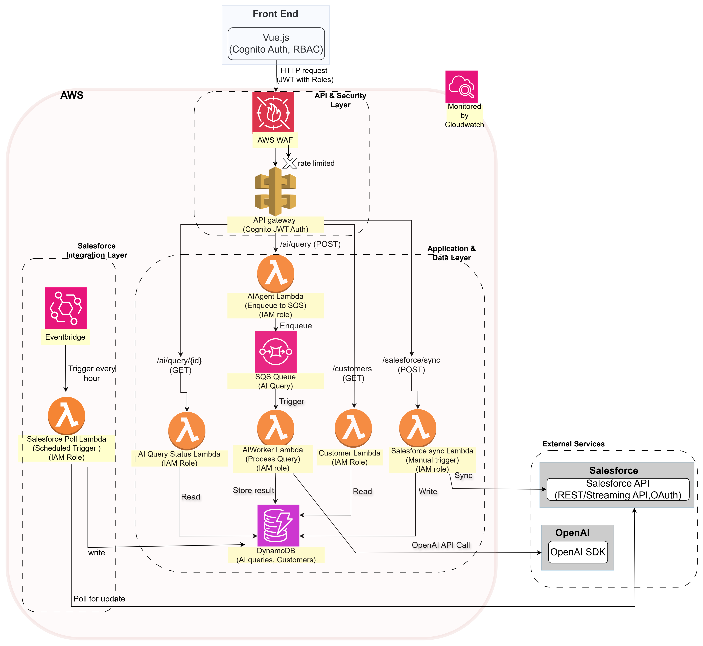

# AI-Powered Multi-Platform SaaS Architecture

A scalable, serverless SaaS platform integrating AWS Lambda, SQS, DynamoDB, OpenAI, Salesforce, and a Vue.js frontend. This project features asynchronous AI query processing, scheduled data synchronization from Salesforce, and role-based access control (RBAC) for security.

---

## Demo Video

[▶️ Watch Demo Video](diagram/DemoVideo.mkv)


<video src="diagram/DemoVideo.mkv" controls></video>
---

## Core Features

- **Asynchronous AI Processing:** User queries are handled asynchronously using SQS and Lambda for a responsive user experience.
- **Salesforce Integration:** Includes both a manual, admin-only sync endpoint and a scheduled, automated polling mechanism to keep customer data up-to-date.
- **Secure Authentication:** Uses a mock JWT-based authentication system with Role-Based Access Control (RBAC) to protect sensitive endpoints.
- **Serverless & Scalable:** Built entirely on AWS serverless components (API Gateway, Lambda, DynamoDB, SQS, EventBridge) that scale automatically.
- **Comprehensive Local Testing:** A full suite of mock tests allows for end-to-end validation of all backend flows without needing real cloud resources.
- **Observability Ready:** All Lambda functions are configured for logging and metrics with Amazon CloudWatch.

---

## Architecture Diagram


Check [Project.pdf](diagram/Project.pdf) for more details.

## Project Structure

```
.
├── backend/
│   ├── ai_agent_lambda/           # Handles AI query submission (enqueue)
│   ├── ai_query_status_lambda/    # Returns AI query status/results
│   ├── ai_worker_lambda/          # Processes AI queries from SQS
│   ├── customers_lambda/          # Customer data API
│   ├── salesforce_poll_lambda/    # Scheduled Salesforce sync
│   ├── salesforce_sync_lambda/    # Manual (admin) Salesforce sync
│   ├── tests/
│   │   └── mock_test_backend.py   # End-to-end backend mock tests
│   ├── common/                    # Shared utilities:
│   │   ├── auth.py                # JWT & RBAC logic
│   │   ├── dynamodb.py            # DynamoDB helpers
│   │   ├── logging.py             # Logging setup
│   │   ├── openai_agent.py        # OpenAI integration
│   │   └── salesforce.py          # Salesforce integration
│   ├── requirements.txt           # Python dependencies
│   └── template.yaml              # AWS SAM/CloudFormation template
│
└── frontend/
    ├── public/
    │   └── index.html                 # Main HTML entry point
    ├── src/
    │   ├── assets/                    # Static assets (images, icons, etc.)
    │   ├── components/                # Vue components
    │   │   ├── AIAgent.vue            # AI query interface component
    │   │   ├── Customers.vue          # Customer list/view component
    │   │   ├── Dashboard.vue          # Main dashboard component
    │   │   └── Login.vue              # Login/authentication component
    │   ├── stores/
    │   │   └── auth.js                # Authentication state management
    │   ├── App.vue                    # Root Vue component
    │   ├── main.css                   # Global styles
    │   └── main.js                    # App entry point and bootstrapping
    ├── .gitignore                     # Git ignore rules
    ├── package.json                   # Frontend dependencies
    ├── package-lock.json              # Exact dependency versions
    └── vue.config.js                  # Vue/Webpack
```

---

## Backend Components

### Lambda Functions

- **`ai_agent_lambda`**: Handles `/ai/query` POST requests. Validates input, generates a `query_id`, and enqueues the job to SQS for asynchronous processing.
- **`ai_worker_lambda`**: Triggered by SQS. Processes queued AI queries using OpenAI and updates DynamoDB with the result.
- **`ai_query_status_lambda`**: Handles `/ai/query/{id}` GET requests. Fetches and returns the status and result of an AI query from DynamoDB.
- **`customers_lambda`**: Handles `/customers` GET requests. Returns all customer records from DynamoDB.
- **`salesforce_sync_lambda`**: Handles `/salesforce/sync` POST requests. **Admin-only endpoint.** Manually triggers a full sync of customer data from Salesforce to DynamoDB.
- **`salesforce_poll_lambda`**: Triggered by an EventBridge schedule (e.g., every hour). Polls Salesforce for recently modified records and updates them in DynamoDB.


### Common Utilities (`backend/common/`)

- **`auth.py`**: Handles JWT decoding and RBAC logic (e.g., `is_admin` check).
- **`dynamodb.py`**, **`openai_agent.py`**, **`salesforce.py`**, **`logging.py`**: Reusable modules for interacting with external services and setting up logging.

### Infrastructure (`template.yaml`)
- **AWS SAM/CloudFormation template** defining all AWS resources: IAM roles, API Gateway endpoints, Lambda functions, DynamoDB tables, SQS queue, and the EventBridge schedule for the polling lambda.

---

## End-to-End Flows

### 1. Asynchronous AI Query

1.  A user submits an AI query from the Vue.js frontend.
2.  The request, containing a JWT, is sent to the `/ai/query` endpoint.
3.  **API Gateway** validates the JWT and routes the request to the **AIAgent Lambda**.
4.  The Lambda enqueues the job to **SQS** and immediately returns a `query_id`.
5.  The **AIWorker Lambda** is triggered by the SQS message, processes the query with **OpenAI**, and stores the result in **DynamoDB**.
6.  The frontend polls the `/ai/query/{id}` endpoint to retrieve the result once it's marked as `COMPLETED`.

### 2. Salesforce Data Synchronization

- **Automated (Polling):**
  1.  An **EventBridge** rule triggers the **SalesforcePoll Lambda** on a schedule (e.g., every hour).
  2.  The Lambda queries Salesforce for records modified since its last run.
  3.  It writes any updates to the `Customers` table in **DynamoDB**.
- **Manual (Admin-Only):**
  1.  An admin user clicks the "Sync" button in the frontend.
  2.  A request is sent to the `/salesforce/sync` endpoint with the admin's JWT.
  3.  The **SalesforceSync Lambda** checks the JWT for an "admins" role. If valid, it proceeds.
  4.  The Lambda fetches all customer data from Salesforce and updates DynamoDB.

---

## Local Development and Testing

This project includes a comprehensive mock testing suite that validates the entire backend logic without deploying to AWS.

### Setup
1.  Navigate to the `backend` directory.
2.  Install dependencies: `pip install -r requirements.txt`.
3.  Ensure you have a local DynamoDB instance (like [LocalStack](https://localstack.cloud/) or DynamoDB Local) running if you want to test against a "real" mock database. The tests are configured to use the endpoint `http://127.0.0.1:4566`.

### Running Tests

**End-to-End Mock Test (`backend/tests/mock_test_backend.py`):**
  - This script tests all major flows together.
  - Run it directly: `python backend/tests/mock_test_backend.py`


---

## Security and Best Practices

- **Authentication**: Endpoints are protected via JWTs, with RBAC used to restrict access to sensitive operations.
- **IAM Roles**: Each Lambda function is configured with least-privilege IAM roles in `template.yaml`.
- **WAF & Throttling**: The `template.yaml` includes definitions for AWS WAF and API Gateway throttling to protect against abuse and common web attacks.

---

## Next Steps & Future Improvements

- **Integrate a real Cognito frontend:** The frontend currently uses mock JWTs. The next step is to integrate a full authentication flow using a library like AWS Amplify.
- **Enhance Observability:** Add custom CloudWatch metrics (e.g., number of failed syncs) and distributed tracing with AWS X-Ray for deeper insights.
- **Refine Error Handling:** Implement dead-letter queues (DLQs) for the SQS queue and more sophisticated retry logic for calls to external services.
- **CI/CD Pipeline:** Set up a CI/CD pipeline (e.g., using GitHub Actions) to automate testing and deployment.
- **Consider Salesforce Streaming API:** For true real-time updates, replace the polling mechanism with a Lambda that subscribes to Salesforce Platform Events or Change Data Capture events.

## Setup
- Deploy backend with AWS SAM/CloudFormation
- Set environment variables for OpenAI and Salesforce credentials
- Run `npm install` and `npm run serve` in `frontend/`
